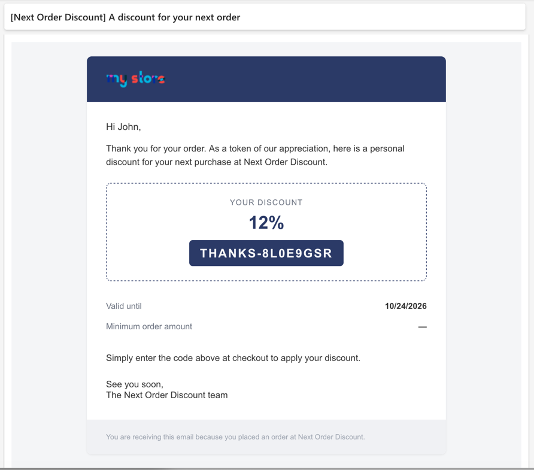
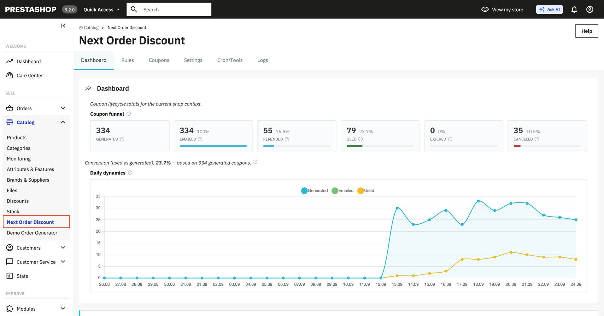
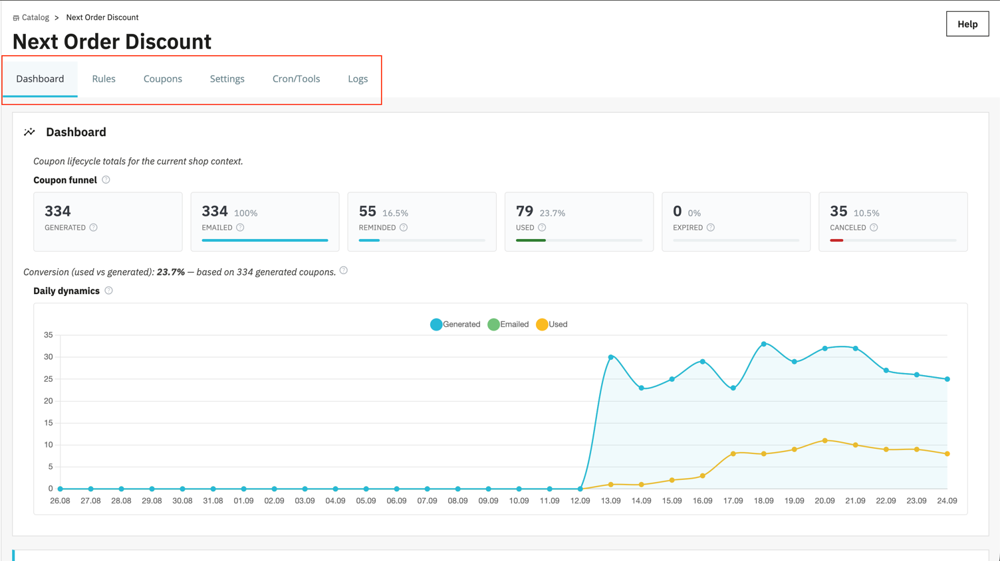
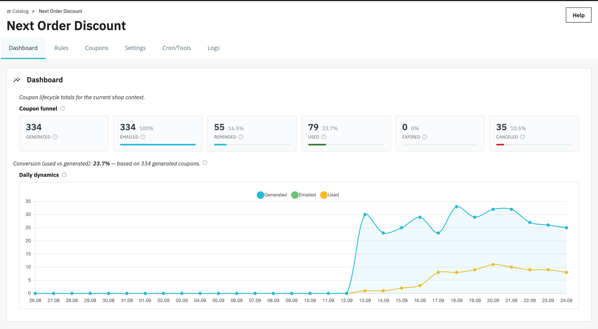
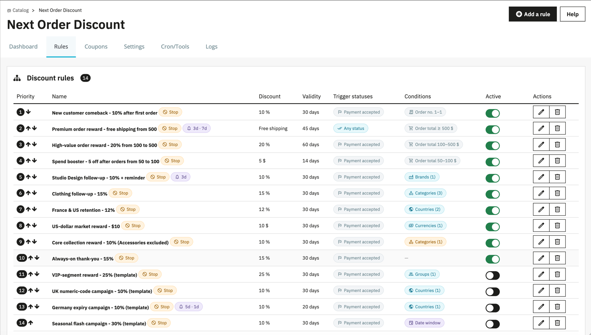
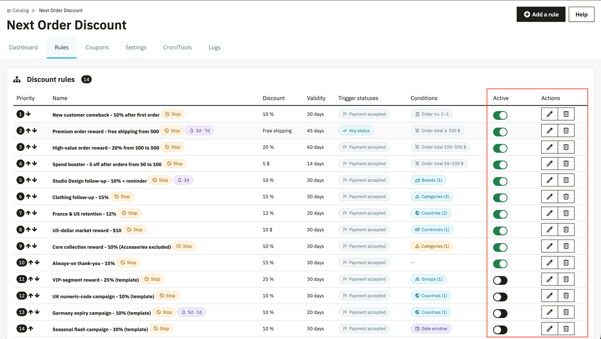
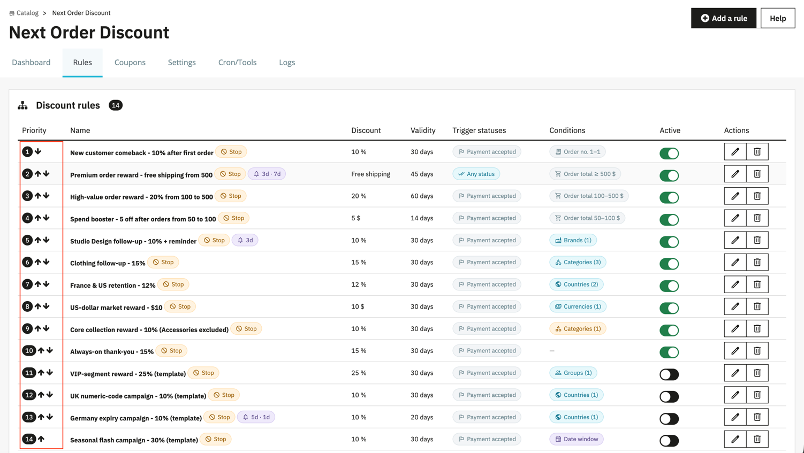
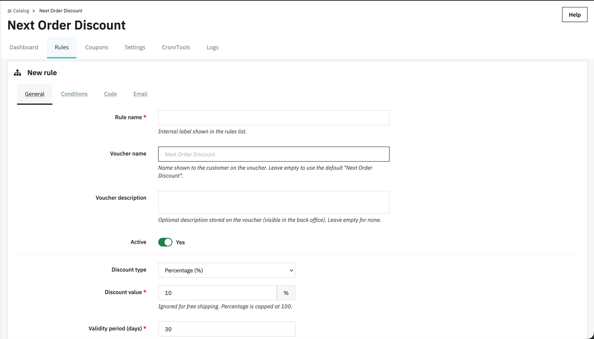
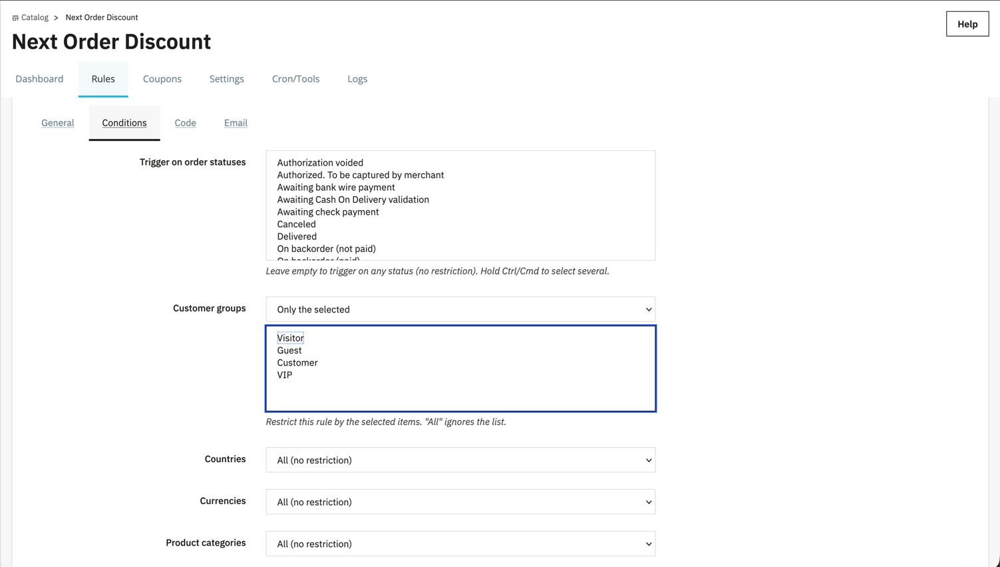
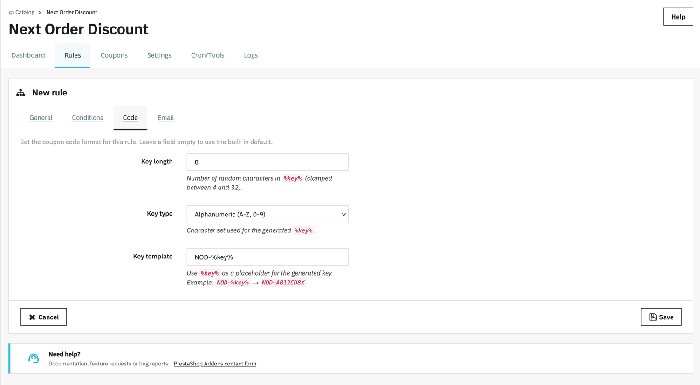

_Versión del módulo: 1.0.0 (Next Order Discount)_

**Next Order Discount** es un módulo que emite automáticamente un cupón personal para el **próximo pedido** del cliente, en cuanto su pedido actual alcanza el estado requerido.

El funcionamiento del módulo se configura mediante **reglas**. En cada regla indica en qué condiciones el cliente recibirá un cupón y qué descuento se aplicará. Puede crear tantas reglas como necesite. Cuando un pedido cumple las condiciones de una de ellas, el módulo crea un cupón y gestiona por sí mismo todo su ciclo de vida: envía el correo al cliente y los recordatorios, vigila la fecha de caducidad y anula el cupón si se reembolsa el pedido.

Lo que recibe el cliente:

- un código de cupón personal para su próxima compra;
- un correo con el cupón justo después de realizar el pedido;
- uno o dos recordatorios mientras el cupón no se haya utilizado ni haya caducado;
- un periodo de validez claro y, si procede, un importe mínimo para el próximo pedido.

**Funcionalidades del módulo:**

- **reglas de descuento**: cree tantas reglas como necesite, defina para cada una sus propias condiciones y su descuento y controle el orden de aplicación mediante la prioridad;
- tres tipos de descuento: **porcentaje**, **importe fijo**, **envío gratuito**; periodo de validez e importe mínimo del próximo pedido, para cada regla;
- **condiciones de activación flexibles**: estados de pedido que dan derecho al cupón, rango de importe del pedido de origen, ventana de actividad por fechas, número de pedido del cliente (por ejemplo, «solo el primer pedido»), exclusión de los pedidos como invitado, así como condiciones por lista en modo **All / Include / Exclude** — grupos de clientes, países, monedas, categorías de productos y marcas;
- la opción **«Stop after this rule»** y la prioridad: o bien un cupón por pedido, o bien varios cupones de reglas distintas;
- un **formato de código propio** para cada regla: longitud, conjunto de caracteres (letras / cifras / alfanumérico) y plantilla con la variable `%key%` (por ejemplo, `NOD-%key%`);
- **correos propios para cada regla**: el correo del cupón y dos correos de recordatorio, por separado **para cada idioma de la tienda**, con vista previa, envío de prueba y selección de idioma en el envío manual desde la lista de cupones;
- **recordatorios**: 1.º y 2.º correo, calculados desde la fecha del correo del cupón o desde la fecha de caducidad; se detienen solos en cuanto el cupón se utiliza o caduca;
- la **cancelación automática** del cupón si el pedido de origen pasa a un estado de cancelación o reembolso;
- tareas en segundo plano mediante **cron** (cola de correos, planificación de los recordatorios, caducidad de los cupones) con asistente de configuración, comprobación del estado y ejecución manual;
- un **panel de control** — embudo de cupones (generados → enviados → con recordatorio → usados → caducados → cancelados), conversión y gráfico de evolución diaria de los últimos 30 días;
- un **registro (Logs)** de los eventos del módulo con filtros y periodo de conservación;
- compatibilidad con **multitienda** (reglas, cupones y ajustes en el contexto de la tienda seleccionada) y con correos multilingües.

**Ejemplo:**

- Regla: «Descuento del 10 % en el próximo pedido, validez de 30 días, para pedidos a partir de 100 €».
- El cliente ha realizado un pedido de 150 € y el pedido ha alcanzado el estado de pago aceptado.
**→ se ha creado para el cliente un cupón personal del −10 %, se ha enviado el correo y, al cabo de unos días, llegará un recordatorio si el cupón no se ha utilizado.**

_Captura de pantalla: cómo recibe el cliente por correo su cupón para el próximo pedido._

## Índice

1. [Dónde abrir el módulo en el back office](#t1)
2. [Qué pestañas hay](#t2)
3. [Cómo funciona el módulo (ciclo de vida del cupón)](#t3)
4. [Pestaña Panel de control: embudo y evolución](#t4)
5. [Pestaña Reglas: tabla de reglas](#t5)
    - [Estructura de la tabla](#t6)
    - [Acciones disponibles](#t7)
    - [Prioridad y orden de las reglas](#t8)
6. [Creación y edición de una regla (Rule)](#t9)
    - [6.1 Pestaña General (principal)](#t10)
    - [6.2 Pestaña Condiciones](#t11)
    - [6.3 Pestaña Código (formato del código)](#t12)
    - [6.4 Pestaña Correo (mensajes)](#t13)
    - [Acciones del formulario](#t14)
7. [Pestaña Cupones: cupones emitidos](#t15)
    - [Filtros](#t16)
    - [Columnas de la tabla](#t17)
    - [Envío manual del correo y de los recordatorios](#t18)
8. [Pestaña Configuración](#t19)
9. [Pestaña Cron/Herramientas: tareas en segundo plano](#t20)
    - [Configuración del cron](#t21)
    - [Estado de las tareas en segundo plano](#t22)
    - [Cola de envío](#t23)
10. [Pestaña Registros: el registro](#t24)
11. [Soporte](#t25)
12. [Inicio rápido (configuración en 5-10 minutos)](#t26)
13. [Lista de comprobación de diagnóstico](#t27)

---

## 1. Dónde abrir el módulo en el back office

1. Acceda al back office de PrestaShop.
2. Abra la sección **Catálogo**.
3. Busque la entrada **Next Order Discount**.

El módulo instala su propia pestaña en el menú «Catálogo» y se abre en su página, con pestañas internas (Panel de control, Reglas, Cupones, Configuración, Cron/Herramientas, Registros).

_Captura de pantalla: la entrada del módulo en la sección «Catálogo»._

## 2. Qué pestañas hay

Al abrirse, el módulo muestra por defecto la pestaña **Panel de control**. Las pestañas disponibles son:

- **Panel de control** (Dashboard) — embudo de cupones, conversión y evolución diaria de la emisión, el envío y el uso de los cupones durante los últimos 30 días. Se abre por defecto.
- **Reglas** (Rules) — gestión de las reglas: creación, edición, activación/desactivación, prioridad, eliminación. Es aquí donde se definen los descuentos y las condiciones de su emisión.
- **Cupones** (Coupons) — lista de todos los cupones emitidos, con su regla, el cliente, el estado y el periodo de validez; reenvío manual del correo y de los recordatorios.
- **Configuración** (Settings) — ajustes generales del módulo: activado/desactivado, estados de cancelación del cupón, modo de depuración, periodo de conservación del registro.
- **Cron/Herramientas** (Cron/Tools) — configuración de las tareas en segundo plano (cron): asistente de instalación, enlaces a las tareas, comprobación del estado, ejecución manual, instantánea de la cola.
- **Registros** (Logs) — registro de eventos del módulo con filtros por nivel y por canal.

Además se abre una subpágina:

- **Regla** (Rule) — el formulario de creación/edición de una regla (se abre desde la pestaña Reglas).

Si la multitienda está activada, todo se lee y se guarda **en el contexto de la tienda seleccionada arriba**. En el contexto «Todas las tiendas», las listas de cupones, el embudo, el gráfico de evolución y la cola se muestran de forma agregada para todas las tiendas.

Al pie de cada página del módulo hay un bloque **¿Necesita ayuda?** con un enlace al formulario de contacto de PrestaShop Addons.

_Captura de pantalla: la barra de pestañas internas del módulo._

---

## 3. Cómo funciona el módulo (ciclo de vida del cupón)

Entender la lógica general permite configurar las reglas más rápido.

1. **Activador.** El módulo escucha los eventos del pedido (validación del pedido y cambio de estado). En cuanto un pedido llega a un estado adecuado, se inicia la comprobación de las reglas.
2. **Selección de la regla.** Las reglas se comprueban **por prioridad** (de arriba abajo en la tabla Reglas). De cada regla se verifican todas sus condiciones. Si la regla encaja, se crea a partir de ella un cupón (una regla de carrito personal de PrestaShop, vinculada al cliente).
   - Si en la regla activada está marcada la opción **Detener después de esta regla**, la comprobación se detiene ahí: el cliente recibirá **un solo** cupón.
   - Si la opción está desactivada, también se comprueban las reglas siguientes, y cada regla coincidente puede emitir **su propio** cupón.
3. **Idempotencia.** Para un mismo pedido de origen, el cupón de una regla se crea una sola vez: las activaciones repetidas del hook no generan duplicados.
4. **Correo.** Justo después de crear el cupón, el módulo intenta enviar el correo al cliente. Si el envío falla, el correo pasa a la cola y el cron repite el intento (véase [Cron/Herramientas](#t20)). El envío automático utiliza el idioma del pedido de origen; si no está disponible, el módulo recurre sucesivamente al idioma de la cuenta del cliente y al idioma predeterminado de la tienda.
5. **Recordatorios.** Si en la regla están activados los recordatorios, el módulo planifica el 1.º y el 2.º correo. Se envían mientras el cupón **no se haya utilizado ni haya caducado**.
6. **Uso.** Cuando el cliente aplica el cupón a un nuevo pedido, el registro correspondiente se marca como **used** y sus recordatorios cesan.
7. **Caducidad.** Al terminar el periodo de validez, el cupón pasa al estado **expired** (mediante una tarea en segundo plano).
8. **Cancelación.** Si el **pedido de origen** pasa a un estado de la lista de cancelación (por defecto, «Cancelado» y «Reembolsado»), el cupón que emitió se desactiva y se marca como **canceled**, y no se crea un cupón nuevo para ese pedido.

Los estados de cupón que verá en el módulo: **created** (creado) → **emailed** (enviado) → **reminded** (recordatorio enviado) → **used** (usado) / **expired** (caducado) / **canceled** (cancelado).

---

## 4. Pestaña Panel de control: embudo y evolución

La pestaña **Panel de control** muestra los resultados generales de las reglas y la variación de los indicadores clave por días, en el contexto de la tienda seleccionada.

### Embudo de cupones (Coupon funnel)
Seis tarjetas con el número de cupones en cada etapa y su proporción respecto a los generados. El porcentaje aparece junto a la cifra y en la barra de color de debajo; para **Generados** no se muestra porcentaje, ya que es el valor de referencia:

- **Generados** — total de cupones generados (base para los porcentajes).
- **Enviados** — para cuántos se ha enviado el correo del cupón.
- **Recordados** — para cuántos se ha enviado al menos un recordatorio.
- **Usados** — utilizados por los clientes.
- **Caducados** — vencidos.
- **Cancelados** — anulados (entre otros motivos, por el reembolso del pedido de origen).

Bajo el embudo figura la **Conversión (usados / generados)**: la proporción de cupones usados sobre los generados. Es el indicador clave de la eficacia de la campaña.

> Las etapas del embudo pueden solaparse y no tienen por qué sumar 100 %: por ejemplo, un cupón usado o caducado sigue contando entre los enviados previamente, si el correo del cupón salió correctamente.

### Evolución diaria (Daily dynamics)

El gráfico de líneas muestra los indicadores de cada día durante los últimos **30 días**, incluido el de hoy:

- **Generados** — cuántos cupones se crearon ese día;
- **Enviados** — cuántos correos de cupón se enviaron correctamente ese día;
- **Usados** — cuántos cupones se utilizaron ese día.

Las tres líneas usan la misma escala, por lo que pueden compararse directamente. Pase el cursor sobre un punto para ver los valores del día. Al hacer clic en un indicador de la leyenda se oculta o se restablece la línea correspondiente; la escala del gráfico se recalcula entonces automáticamente. Si no ha habido ningún evento en los últimos 30 días, el gráfico no se muestra.

> En multitienda, los datos se muestran en el contexto de la tienda seleccionada arriba (agregados en «Todas las tiendas»).

_Captura de pantalla: la pestaña Panel de control (embudo y evolución diaria)._

---

## 5. Pestaña Reglas: tabla de reglas

Es el área de trabajo principal: aquí se enumeran todas las reglas de emisión de cupones de la tienda actual. El botón **Añadir una regla** (en la cabecera de la página) abre el formulario de creación. Tras una instalación nueva, el módulo no crea ninguna regla activa automáticamente: mientras no añada y active usted mismo una regla, no se emitirá ningún cupón.

Si todavía no hay reglas, en lugar de la tabla se muestra el aviso **Todavía no hay reglas de descuento** y un botón adicional **Añadir una regla**: púlselo, o use el botón del mismo nombre en la cabecera de la página, para crear su primera regla.

### Estructura de la tabla

Cada fila es una regla. Las columnas son:

- **Prioridad** — la prioridad (un número) y las flechas para moverla arriba/abajo. Las reglas se comprueban en ese orden.
- **Nombre** — el nombre interno de la regla. Junto a él pueden aparecer distintivos:
  - **Stop** — está activada la opción «detenerse después de esta regla»;
  - un distintivo con una campana y días (por ejemplo, `1d · 3d`) — los recordatorios están activados, con su calendario.
- **Descuento** — el resultado del descuento (por ejemplo, `10%`, `15 €`, `Envío gratuito`).
- **Validez** — el periodo de validez del cupón, en días.
- **Estados que activan** — los estados de pedido que activan la regla (o el distintivo **Cualquier estado** si no hay restricción).
- **Condiciones** — el conjunto de distintivos de las condiciones activas (grupos, países, monedas, categorías, marcas, rangos). Un guion indica que no hay condiciones.
- **Activo** — el interruptor de activación de la regla (Sí/No).
- **Acciones** — edición y eliminación.

_Captura de pantalla: la tabla de reglas con sus columnas y distintivos._

### Acciones disponibles

**Editar** — abre el formulario de edición de la regla.

**Eliminar** — elimina la regla (con confirmación). Los cupones ya emitidos a partir de ella permanecen en la tabla Cupones.

**Activo (Sí/No)** — un interruptor rápido directamente en la fila: una regla desactivada no participa en la emisión de cupones.

**Flechas de prioridad (▲ ▼)** — desplazan la regla arriba o abajo en el orden de comprobación.

_Captura de pantalla: los botones Editar / Eliminar y el interruptor Activo._

### Prioridad y orden de las reglas

Las reglas se comprueban **de arriba abajo**, por prioridad. El orden importa cuando:

- varias reglas tienen activada la opción **Detener después de esta regla** — se aplica la primera regla coincidente según la prioridad y las demás no se comprueban;
- desea que una regla más «específica» (por ejemplo, para un grupo VIP) tenga la oportunidad de aplicarse antes que una regla general.

Las prioridades se mantienen automáticamente como una secuencia continua de 1 a N (moverlas con las flechas renumera el conjunto).

_Captura de pantalla: desplazamiento de una regla con las flechas de prioridad._

---

## 6. Creación y edición de una regla (Rule)

El formulario de regla se abre con el botón **Añadir una regla** o **Editar**. Está dividido en cuatro pestañas: **General**, **Condiciones**, **Código**, **Correo**. Abajo se encuentran los botones **Guardar** y **Cancelar** (comunes a todas las pestañas).

### 6.1 Pestaña General (principal)

**Nombre de la regla** (Rule name) — el nombre interno, que se muestra en la tabla de reglas. Campo obligatorio.

**Nombre del vale** (Voucher name) — el nombre del cupón que ve el cliente. Vacío = se usa el valor predeterminado «Next Order Discount».

**Descripción del vale** (Voucher description) — una descripción opcional que se guarda en el cupón (visible en el back office).

**Activo** (Active) — si la regla está activada (Sí/No).

Bloque de descuento:

- **Tipo de descuento** (Discount type):
  - **Porcentaje (%)** — un porcentaje del importe del próximo pedido;
  - **Importe fijo** — una cantidad fija (en la moneda);
  - **Envío gratuito**.
- **Valor del descuento** (Discount value) — la cuantía del descuento. En el caso del porcentaje, está limitada a 100. La etiqueta de la derecha (`%` o el símbolo de la moneda) se ajusta automáticamente al tipo elegido; con el tipo **Envío gratuito**, el campo se oculta (no hace falta un valor de descuento).
- **Periodo de validez (días)** (Validity period) — el periodo de validez del cupón en días (número entero, como mínimo 1).
- **Importe mínimo del siguiente pedido** (Minimum next order amount) — el importe mínimo del próximo pedido a partir del cual el cupón es aplicable. `0` = sin restricción.

Bloque de lógica de emisión:

- **Detener después de esta regla** (Stop after this rule) — si es Sí, tras activarse esta regla no se comprueban las demás (el cliente recibe un solo cupón). Si es No, otras reglas coincidentes también podrán emitir sus cupones.

Bloque de recordatorios:

- **Enviar recordatorios** (Send reminders) — activar los correos de recordatorio de un cupón sin utilizar. Los recordatorios se detienen automáticamente cuando el cupón se usa o caduca.
- **Momento de los recordatorios** (Reminder timing) — desde qué punto contar los días:
  - **Días después del correo del cupón** — N días después del correo del cupón;
  - **Días antes de que caduque el cupón** — N días antes de la caducidad del cupón.
- **Primer recordatorio (días)** / **Segundo recordatorio (días)** — el calendario del 1.º y del 2.º recordatorio. `0` o vacío = ese recordatorio no se envía.

_Captura de pantalla: la pestaña General del formulario de regla._

### 6.2 Pestaña Condiciones

Todas las condiciones definidas deben cumplirse simultáneamente (lógica Y). Una condición vacía o con `Todos` no restringe nada.

**Activar en los estados de pedido** (Trigger on order statuses) — los estados en los que un pedido puede emitir un cupón. La regla se comprueba al crearse el pedido y en cada cambio de su estado. Una lista vacía significa que el estado no restringe la regla. Para seleccionar varios estados, mantenga Ctrl/Cmd. El cupón se emite solo si el pedido cumple también las demás condiciones de la regla.

Condiciones por lista: cada una tiene un modo y una lista.

- **Grupos de clientes** (Customer groups);
- **Países** (Countries) — según la dirección de entrega del pedido;
- **Monedas** (Currencies) — la moneda del pedido;
- **Categorías de productos** (Product categories) — las categorías de los productos del pedido;
- **Marcas** (Brands) — las marcas (fabricantes) de los productos del pedido.

El modo de cada una:

- **Todos (sin restricción)** — no restringir (la lista se ignora);
- **Solo los seleccionados** — la regla se aplica únicamente a los elementos seleccionados;
- **Todos excepto los seleccionados** — la regla se aplica a todos salvo a los seleccionados.

La lista de selección aparece solo en los modos **Solo los seleccionados** / **Todos excepto los seleccionados**; en el modo **Todos** permanece oculta para no estorbar.

Condiciones por rango:

- **Total del pedido de origen** (Source order total) — el rango de importe del pedido de origen (**Mín.** / **Máx.**). `0` = sin restricción en ese límite.
- **Periodo de actividad** (Active date window) — la ventana de actividad de la regla (**Desde** / **Hasta**). Ambos vacíos = la regla está siempre activa.
- **Número de pedidos del cliente** (Customer order number) — cuántos pedidos debe tener el cliente (**Mín.** / **Máx.**). Ambos valores a `1` = solo el primer pedido. `0` = sin restricción. Los pedidos de un mismo cliente se cuentan en la tienda actual por correo electrónico, aunque PrestaShop haya creado varios registros de cliente para la misma dirección; el pedido actual ya está incluido en esa cifra.
- **Solo clientes registrados** (Registered customers only) — si es **Sí**, los pedidos como invitado no participan en la regla. Si es **No**, la regla comprueba por igual a los clientes registrados y a los invitados. Se recomienda activarla para los escenarios de «primer pedido» y de recuperación de clientes: al comprar como invitado, PrestaShop puede crear un registro de cliente nuevo cada vez, de modo que un invitado que vuelve solo puede identificarse de forma fiable por la coincidencia del correo electrónico.

> Las condiciones de categorías y marcas se refieren a los productos del **pedido de origen**. El módulo carga los datos de producto únicamente cuando al menos una regla activa filtra realmente por categorías o marcas: así se ahorran recursos en el resto de los pedidos.

_Captura de pantalla: la pestaña Condiciones._

### 6.3 Pestaña Código (formato del código)

El formato del código de cupón se define **para cada regla**. Cualquier campo puede dejarse vacío: en ese caso se usa el valor predeterminado integrado.

- **Longitud de la clave** (Key length) — el número de caracteres aleatorios de `%key%` (limitado al rango 4-32).
- **Tipo de clave** (Key type) — el conjunto de caracteres para la generación:
  - **Alfabético (A-Z)** — solo letras;
  - **Numérico (0-9)** — solo cifras;
  - **Alfanumérico (A-Z, 0-9)** — letras y cifras.
- **Plantilla de la clave** (Key template) — la plantilla del código con la variable `%key%`. Ejemplo: `NOD-%key%` → `NOD-AB12CD8X`.

_Captura de pantalla: la pestaña Código._

### 6.4 Pestaña Correo (mensajes)

Cada regla tiene **sus propios correos**, precargados con la plantilla predeterminada. Se configuran tres tipos:

- **Correo del cupón** (Coupon email) — el correo del cupón (se envía al emitirlo);
- **Correo del primer recordatorio** (First reminder email) — el primer recordatorio;
- **Correo del segundo recordatorio** (Second reminder email) — el segundo recordatorio.

Para cada tipo:

- un selector de **idioma** (por código ISO): el asunto y el HTML se definen **por separado para cada idioma** de la tienda;
- el campo **Asunto** (Subject) — el asunto del correo;
- el campo **Contenido HTML** (HTML content) — el cuerpo HTML del correo;
- bajo el campo HTML, la línea **Marcadores disponibles (haga clic para insertar)**: «fichas» de marcadores en las que se puede hacer clic. Al pulsar una, el marcador se inserta directamente en el campo HTML, en la posición del cursor: así no hace falta escribirlos a mano.

Marcadores que se sustituyen por valores reales al enviar:

- cupón: `{coupon_code}`, `{coupon_value}`, `{valid_to}`, `{minimum_amount}`;
- cliente: `{customer_firstname}`, `{customer_lastname}`, `{customer_fullname}`, `{customer_title}` (el tratamiento, por ejemplo «Mr»/«Mrs»; vacío si no se ha indicado el sexo), `{customer_email}`;
- tienda: `{shop_name}`, `{shop_url}`, `{shop_logo}`. El marcador `{shop_url}` es compatible con el envío, pero debe introducirse manualmente en el HTML si se necesita.

Cada idioma del correo usa su propio asunto y su propio HTML: los textos de otras versiones lingüísticas no se sustituyen. Si para el idioma seleccionado no se han guardado el asunto ni el HTML, el módulo utiliza la plantilla integrada: francés para **FR** e inglés para **EN** y todos los demás idiomas. Antes de activar una regla, rellene y guarde los correos de todos los idiomas de la tienda.

Acciones bajo cada correo:

- **Vista previa** (Preview) — vista previa del correo con valores de ejemplo para los marcadores (se abre en una ventana).
- **Enviar correo de prueba** (Send test email) — envío de una copia de prueba a la dirección indicada (también con valores de ejemplo). Práctico para comprobar la maquetación antes del envío real.

_Captura de pantalla: la pestaña Correo._

### Acciones del formulario

- **Guardar** — comprueba y guarda la regla, y vuelve a la lista de Reglas. Si hay errores de validación, el formulario permanece abierto con las indicaciones.
- **Cancelar** — vuelve a la lista sin guardar.

_Captura de pantalla: los botones Guardar / Cancelar._

---

## 7. Pestaña Cupones: cupones emitidos

La pestaña **Cupones** es la lista de todos los cupones generados (solo consulta + acciones manuales de envío).

### Filtros

- **Estado** — filtro por estado del cupón (created / emailed / reminded / used / expired / canceled) o «Todos los estados».
- **Código** — búsqueda por código de cupón.
- Los botones **Filtrar** y **Restablecer**.

La lista está paginada (30 registros por página).

_Captura de pantalla: los filtros de la pestaña Cupones._

### Columnas de la tabla

- **Código** — el código del cupón.
- **Cliente** — el nombre y el correo del cliente (o su identificador, si el nombre no está disponible).
- **Pedido de origen** — el número del pedido que ha emitido el cupón.
- **Regla** — la regla con la que se creó el cupón.
- **Estado** — el estado actual (con un distintivo de color). Junto a él pueden aparecer los distintivos `1` / `2`, que indican qué recordatorios ya se han enviado.
- **Válido hasta** — el periodo de validez del cupón; la fecha y la hora se muestran en el formato de la configuración regional actual de PrestaShop.
- **Creado** — la fecha y la hora de creación, en el formato de la configuración regional actual de PrestaShop.
- **Acciones** — las acciones manuales (véase más abajo).

_Captura de pantalla: la tabla de cupones._

### Envío manual del correo y de los recordatorios

Mientras el cupón **todavía se pueda utilizar** (no sea used / expired / canceled), en la columna Acciones están disponibles:

- **Idioma del correo que se enviará** — la selección del idioma para el envío manual (se muestra si en la tienda hay más de un idioma instalado). Por defecto está seleccionado el idioma del pedido de origen; el valor elegido se aplica tanto al reenvío del cupón como al envío manual de un recordatorio;
- el botón con el **sobre** (ayuda emergente **Volver a enviar al cliente el correo del cupón**) — reenviarlo;
- los botones con la **campana y el número 1 / 2** — enviar de inmediato el recordatorio correspondiente (aparecen si en la regla del cupón están activados esos recordatorios).

Para los cupones usados, caducados y cancelados, las acciones no están disponibles: su correo y sus recordatorios ya no tienen sentido.

_Captura de pantalla: los botones de reenvío y de recordatorio en la fila de un cupón._

---

## 8. Pestaña Configuración

La pestaña **Configuración** contiene los ajustes generales del módulo (los descuentos y las condiciones se definen en las reglas, no aquí).

- **Módulo activo** (Module active) — el interruptor general. Si es **No**, no se emiten cupones para los pedidos nuevos, con independencia de las reglas.
- **Cancelar el cupón en estos estados de pedido** (Cancel coupon on order statuses) — los estados de pedido a los que, al pasar, el cupón emitido por ese pedido se **anula** (se desactiva y se marca como canceled), y no se crea un cupón nuevo para ese pedido. Por defecto: «Cancelado» y «Reembolsado». Vacío = no cancelar nunca automáticamente. Se seleccionan varios con Ctrl/Cmd.
- **Modo de depuración** (Debug mode) — registro detallado para el diagnóstico. En producción, manténgalo desactivado.
- **Conservar los registros durante (días)** (Keep logs for) — el periodo de conservación de las entradas del registro; las más antiguas se eliminan automáticamente (durante el cron). `0` = conservar indefinidamente.

Pulse **Guardar** para aplicar los cambios. Los ajustes se guardan en el contexto de la tienda actual (multitienda).

_Captura de pantalla: la pestaña Configuración._

---

## 9. Pestaña Cron/Herramientas: tareas en segundo plano

Tras crear un cupón, el módulo intenta enviar de inmediato el correo principal. Si el envío falla, el correo pasa a la cola y el **cron** repite el intento. El cron también planifica y envía los correos de recordatorio y pasa los cupones vencidos al estado **expired**.

### Configuración del cron

El método recomendado consiste en añadir **una sola línea** al crontab del servidor que, cada 5 minutos, invoque por HTTP la tarea combinada. Este método funciona en cualquier alojamiento y no depende de la versión de PHP del servidor.

En la pestaña encontrará:

- **Instalación con un clic** (One-click install) — si en el servidor es posible configurar el crontab automáticamente, el botón **Instalar el cron automáticamente** añadirá la línea necesaria y **Eliminar el cron** la quitará. La línea se delimita con marcadores y se elimina también al desinstalar el módulo. Si la instalación automática no está disponible (por ejemplo, porque `shell_exec` está bloqueado en un alojamiento compartido), el módulo explicará el motivo y propondrá copiar la línea manualmente.
- **Línea de crontab (curl / wget)** — líneas listas para pegar manualmente en el crontab.
- **O utilice un servicio de cron externo** — la URL destinada a los servicios web-cron externos (por ejemplo, cron-job.org), con un intervalo de 5 minutos.
- **Ejecutar todas las tareas ahora** — lanzamiento manual de todas las tareas a la vez (una comprobación rápida de que la URL funciona).
- **Su servidor** — un sondeo del entorno: versión de PHP, presencia de curl (CLI), disponibilidad de shell_exec, para indicarle el método que funcionará.

> **Mantenga el token en secreto.** Las URL de las tareas contienen un token secreto: cualquiera que conozca una URL puede ejecutar la tarea correspondiente.

_Captura de pantalla: el bloque de configuración del cron._

### Estado de las tareas en segundo plano

La tabla **Tareas** enumera las tareas en segundo plano, su frecuencia recomendada, la hora de su última ejecución, su URL personal, el estado del bloqueo y un botón de ejecución manual.

Las tareas del módulo:

- **Procesar la cola de envío** — reintenta el envío fallido del correo principal y envía los recordatorios planificados. Recomendado **cada 5 minutos**.
- **Planificar los recordatorios de cupones** — localiza los recordatorios que ya vencen y los coloca en la cola. Recomendado **cada 30 minutos**.
- **Caducar los cupones vencidos** — pasa los cupones vencidos al estado expired. Recomendado **una vez al día**.

La columna **Última ejecución** muestra el estado de la tarea: **OK** (se ejecuta a tiempo), **Con retraso** (va con retraso), **No está en ejecución** (hace mucho que no se ejecuta), **Nunca ejecutado** (ninguna vez). La columna **Bloqueo** indica si la tarea se está ejecutando en este momento (**En ejecución**) o está libre (**Libre**): el bloqueo impide que dos ejecuciones se solapen.

Un bloque aparte, **Cron gestionado**, informa de si la línea de cron la ha instalado el propio módulo.

_Captura de pantalla: la tabla de tareas con su frecuencia y su estado actual._

### Cola de envío

Abajo se encuentra una instantánea de la cola: **Pendiente / En proceso / Hecho / Fallido**. Un número creciente de pendientes o una cantidad notable de fallos son motivo para revisar el cron y la configuración del correo.

_Captura de pantalla: la instantánea de la cola de envío._

---

## 10. Pestaña Registros: el registro

La pestaña **Registros** es el registro de eventos del módulo (emisión de cupones, envío de correos, errores de hooks, etc.).

- El filtro **Nivel** — el nivel de la entrada: debug / info / warning / error (o «Todos»).
- El filtro **Canal** — el canal (por ejemplo, `cron`, `queue`, `coupon`).
- Las columnas: **Fecha**, **Nivel** (con un distintivo de color), **Canal**, **Mensaje** (con los detalles del contexto), **Correlación** (el identificador que enlaza las entradas de un mismo evento).

La lista está paginada. El nivel de detalle del registro depende del **Modo de depuración**, y el periodo de conservación, del ajuste **Conservar los registros durante** (ambos ajustes están en la pestaña [Configuración](#t19)). En el contexto de una tienda concreta también se muestran las entradas generales de cron y de cola creadas sin vinculación a una sola tienda: así puede ver los errores de segundo plano incluso con el modo de depuración desactivado. La entrada relativa a la emisión de un cupón contiene el `id_lang` y el código ISO del idioma en el que se enviará el correo automático.

_Captura de pantalla: la pestaña Registros con sus filtros._

---

## 11. Soporte

Al pie de las páginas del módulo hay un bloque **¿Necesita ayuda?** con un enlace al formulario de contacto oficial de PrestaShop Addons:

https://addons.prestashop.com/contact-form.php

Póngase en contacto con nosotros si:

- necesita ayuda con la configuración inicial de las reglas o del cron;
- los cupones o los correos no se comportan como esperaba;
- requiere una mejora o una personalización de la funcionalidad;
- se producen errores o un comportamiento inestable;
- tiene ideas para mejorar el módulo.

_Captura de pantalla: el bloque de soporte._

---

## 12. Inicio rápido (configuración en 5-10 minutos)

1. Abra la pestaña **Configuración** y ponga **Módulo activo = Sí**. Si es necesario, configure **Cancelar el cupón en estos estados de pedido**. Pulse **Guardar**.
2. Configure el **cron** en la pestaña **Cron/Herramientas**: pulse **Instalar el cron automáticamente** (si está disponible) o copie la línea recomendada en el crontab o en un servicio web-cron externo. Pulse **Ejecutar todas las tareas ahora** para comprobarlo.
3. Cree una regla en la pestaña **Reglas → Añadir una regla**:
   - **General**: el nombre, el tipo y la cuantía del descuento, el periodo de validez y, si procede, el importe mínimo del próximo pedido y los recordatorios;
   - **Condiciones**: los estados de pedido que dan derecho al cupón y, si hace falta, las restricciones (grupos, países, importes, número de pedido, etc.); para las reglas de primer pedido o de cliente recurrente, decida si conviene activar **Solo clientes registrados**;
   - **Código**: el formato del código (o déjelo por defecto);
   - **Correo**: revise los textos de los correos y utilice **Vista previa** y **Enviar correo de prueba**.
4. Guarde la regla y asegúrese de que tiene **Activo = Sí**.
5. Compruebe la regla con un pedido de prueba: lleve el pedido a uno de los estados indicados en la regla y verifique que en la pestaña **Cupones** aparece un cupón y que el correo se ha enviado. Si el primer intento falló, ejecute las tareas en segundo plano manualmente desde la pestaña **Cron/Herramientas**.
6. Siga los resultados en la pestaña **Panel de control**: valore el embudo, la conversión y la evolución diaria de los últimos 30 días.

---

## 13. Lista de comprobación de diagnóstico

**No se crea el cupón:**

1. **Módulo activo = Sí** (Configuración).
2. Existe al menos una regla con **Activo = Sí** (Reglas).
3. El pedido pasa realmente a uno de los **Estados que activan** la regla (o la regla admite «cualquier estado»).
4. El pedido cumple **todas** las condiciones de la regla: rango de importe, ventana de fechas, número de pedido del cliente, tipo de cliente (invitado o registrado), grupos/países/monedas/categorías/marcas.
5. Compruebe el orden: si una regla de prioridad superior tiene **Detener después de esta regla**, las reglas situadas por debajo no se comprueban.
6. Consulte los **Registros** (con **Modo de depuración = Sí** hay más entradas).

**El cliente no recibe el correo:**

1. Revise la configuración de correo de la tienda; envíe un **correo de prueba** desde la pestaña Correo de la regla.
2. Para un cupón concreto puede elegir el idioma deseado y pulsar el botón del sobre en la pestaña Cupones.
3. Si el primer intento de envío terminó con error, asegúrese de que el **cron** funciona (Cron/Herramientas → tarea **Procesar la cola de envío**, estado **OK**) y pulse **Ejecutar todas las tareas ahora** para reintentarlo.
4. En la cola no debe haber entradas **Pendiente** atascadas ni un número creciente de **Fallido** (Cron/Herramientas → **Cola de envío**).
5. Si el correo llegó en el idioma equivocado, revise el texto de ese idioma en la pestaña **Correo** de la regla. De forma automática, el módulo usa el idioma del pedido; en el envío manual, el idioma seleccionado junto a los botones de acción.

**No se envían los recordatorios:**

1. La regla tiene **Enviar recordatorios = Sí** y un calendario definido (**Primer/Segundo recordatorio** > 0).
2. La tarea **Planificar los recordatorios de cupones** funciona (Cron/Herramientas).
3. El cupón **todavía se puede utilizar** (no es used / expired / canceled): para los cupones que ya no son válidos no se envían recordatorios.

**El cupón se ha cancelado de forma inesperada:**

- El pedido de origen ha pasado a un estado de la lista **Cancelar el cupón en estos estados de pedido** (Configuración). Retire ese estado de la lista si este comportamiento no es el deseado.

**Los cupones no caducan (siguen en sus estados antiguos):**

- La tarea **Caducar los cupones vencidos** no funciona: compruebe el cron (Cron/Herramientas).
