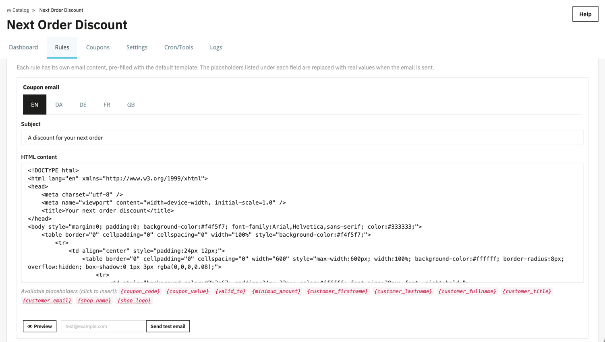
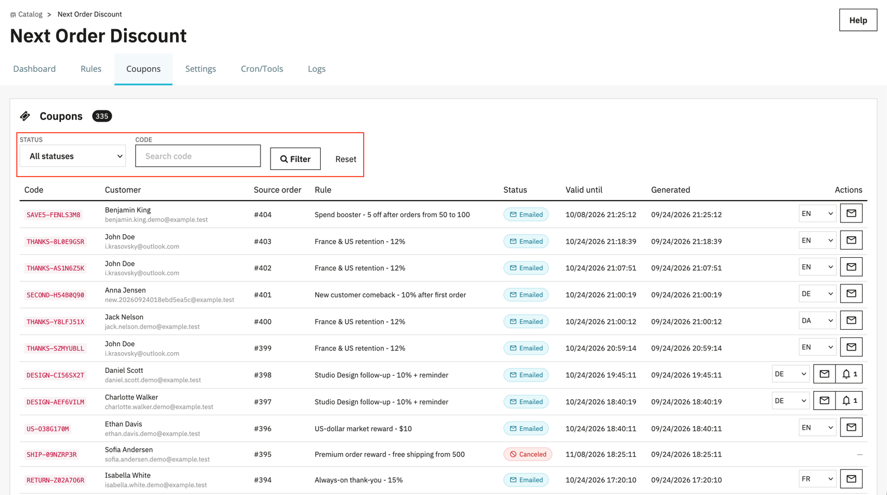
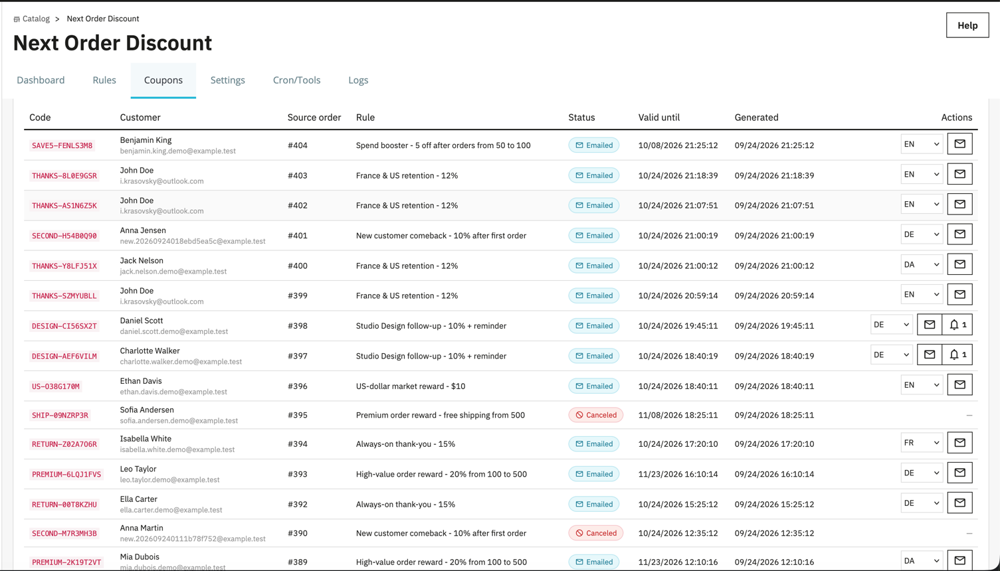
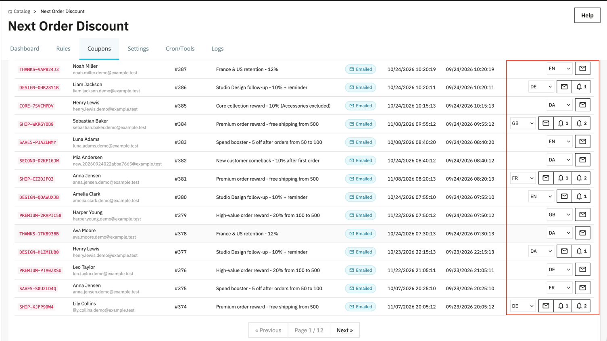
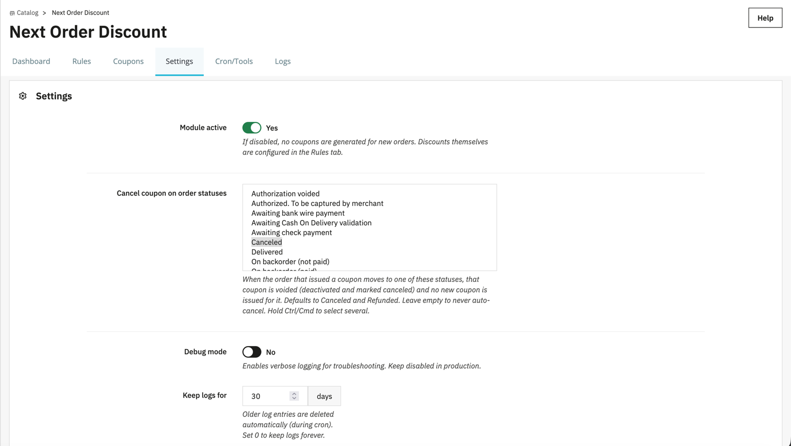
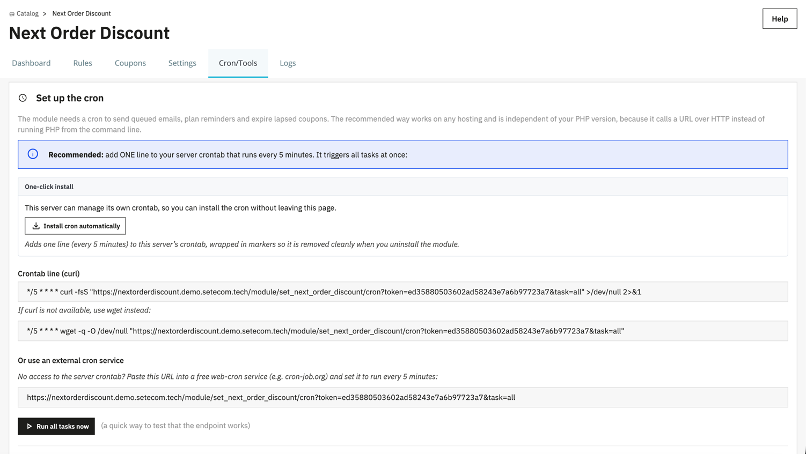
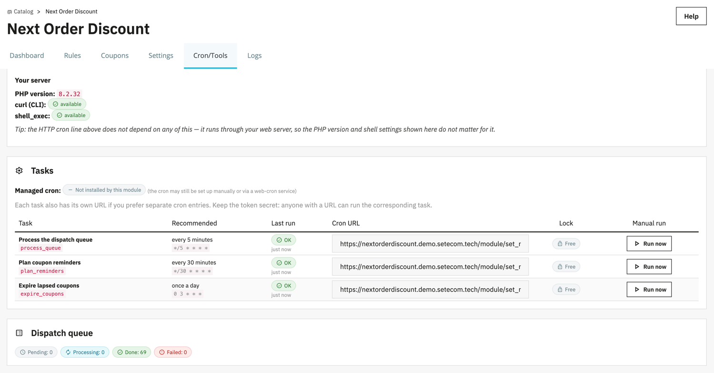
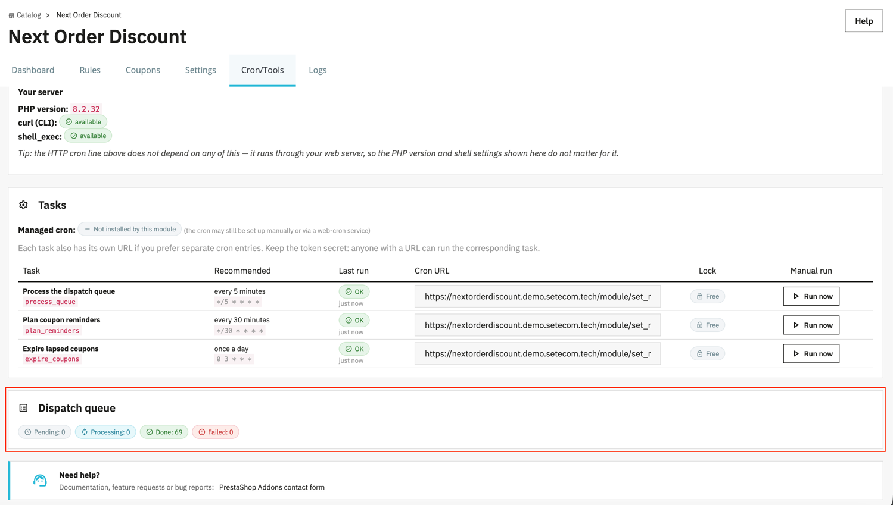
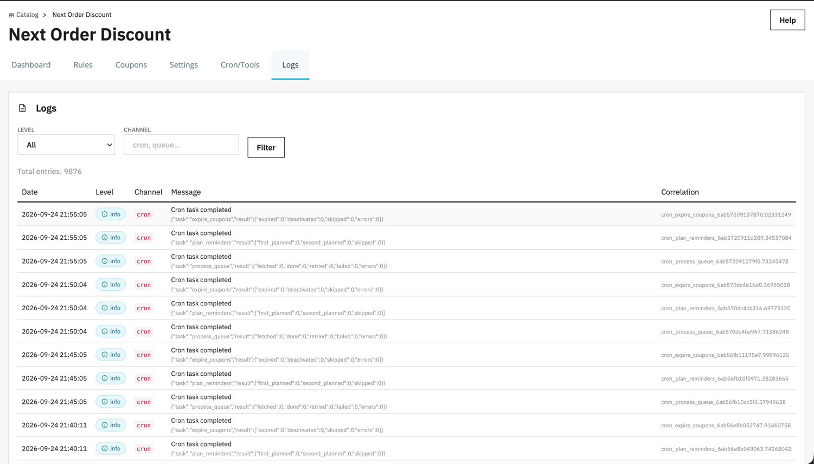
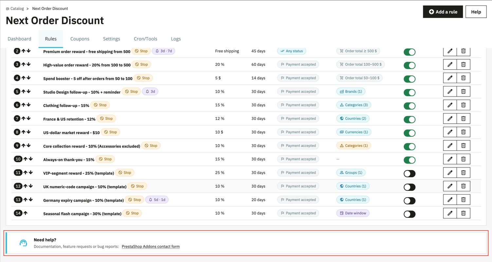

_Версия модуля: 1.0.0 (Next Order Discount)_

**Next Order Discount** — модуль, который автоматически выдаёт покупателю персональный купон на **следующий заказ** после того, как его текущий заказ доходит до нужного статуса.

Вместо одной глобальной скидки модуль работает на **движке правил**: вы описываете любое количество **правил**, где каждое связывает набор условий (когда выдавать) с результатом (какую скидку выдать). Когда заказ подходит под правило — создаётся купон. Весь дальнейший жизненный цикл купона (письмо покупателю, напоминания, истечение срока, отмена при возврате заказа) модуль ведёт сам.

Что получает покупатель:

- персональный купонный код на следующую покупку;
- письмо с купоном сразу после оформления заказа;
- одно-два напоминания, пока купон не использован и не просрочен;
- понятный срок действия и (при необходимости) минимальную сумму следующего заказа.

**Возможности модуля:**

- **движок правил**: сколько угодно правил, каждое со своими условиями и своей скидкой; правила выполняются по приоритету;
- три типа скидки: **процент**, **фиксированная сумма**, **бесплатная доставка**; срок действия и минимальная сумма следующего заказа — на каждое правило;
- **гибкие условия** срабатывания: триггерные статусы заказа, диапазон суммы заказа-источника, окно активности по датам, номер заказа покупателя (например, «только первый заказ»), а также списочные условия в режиме **All / Include / Exclude** — группы клиентов, страны, валюты, категории товаров и бренды;
- флаг **«Stop after this rule»** и приоритет: либо один купон на заказ, либо несколько купонов от разных правил;
- **персональный формат кода** для каждого правила: длина, набор символов (буквы / цифры / буквенно-цифровой) и шаблон с плейсхолдером `%key%` (например `NOD-%key%`);
- **свои письма на каждое правило**: купонное письмо и два письма-напоминания, отдельно **на каждый язык магазина**, с предпросмотром и отправкой тестового письма прямо из админки;
- **напоминания**: 1-е и 2-е письмо, отсчёт либо от даты купонного письма, либо от даты истечения; останавливаются сами, когда купон использован или просрочен;
- **автоматическая отмена** купона, если заказ-источник ушёл в отменённый/возвращённый статус;
- фоновые задачи по **cron** (очередь писем, планирование напоминаний, истечение купонов) с помощником настройки, проверкой здоровья задач и ручным запуском;
- **Dashboard** — воронка купонов (сгенерировано → отправлено → напомнено → использовано → просрочено → отменено) и конверсия;
- **журнал (Logs)** событий модуля с фильтрами и сроком хранения;
- поддержка **мультимагазина** (правила, купоны и настройки — в контексте выбранного магазина) и мультиязычности писем.

**Пример:**

- Правило: «Скидка 10% на следующий заказ, срок 30 дней, для заказов от 100 €».
- Покупатель оформил заказ на 150 € и заказ дошёл до оплаченного статуса.
**→ покупателю создан персональный купон −10%, отправлено письмо, через несколько дней придёт напоминание, если купон не использован.**

_Скриншот: Как покупатель получает купон на следующий заказ в письме._

## Содержание

1. [Где открыть модуль в админке](#t1)
2. [Какие есть вкладки](#t2)
3. [Как работает модуль (жизненный цикл купона)](#t3)
4. [Вкладка Dashboard: воронка купонов](#t4)
5. [Вкладка Rules: таблица правил](#t5)
    - [Структура таблицы](#t6)
    - [Доступные действия](#t7)
    - [Приоритет и порядок правил](#t8)
6. [Создание и редактирование правила (Rule)](#t9)
    - [6.1 Вкладка General (основное)](#t10)
    - [6.2 Вкладка Conditions (условия)](#t11)
    - [6.3 Вкладка Code (формат кода)](#t12)
    - [6.4 Вкладка Email (письма)](#t13)
    - [Действия формы](#t14)
7. [Вкладка Coupons: выданные купоны](#t15)
    - [Фильтры](#t16)
    - [Столбцы таблицы](#t17)
    - [Ручные действия (Resend / напоминания)](#t18)
8. [Вкладка Settings](#t19)
9. [Вкладка Cron/Tools: фоновые задачи](#t20)
    - [Настройка cron](#t21)
    - [Задачи и их здоровье](#t22)
    - [Очередь отправки](#t23)
10. [Вкладка Logs: журнал](#t24)
11. [Поддержка](#t25)
12. [Быстрый старт (настройка за 5–10 минут)](#t26)
13. [Чек-лист диагностики](#t27)

---

## 1. Где открыть модуль в админке

1. Войдите в админ-панель PrestaShop.
2. Откройте раздел **Каталог**.
3. Найдите пункт **Next Order Discount**.

Модуль устанавливает собственную вкладку в меню «Каталог» и открывается на своей странице с внутренними вкладками (Dashboard, Rules, Coupons, Settings, Cron/Tools, Logs).

_Скриншот: Пункт модуля в разделе «Каталог»._

## 2. Какие есть вкладки

При открытии модуль по умолчанию показывает вкладку **Dashboard**. Доступные вкладки:

- **Dashboard** — воронка купонов и конверсия, снимок очереди отправки. Открывается по умолчанию.
- **Rules** — управление правилами: создание, редактирование, включение/выключение, приоритет, удаление. Именно здесь задаются скидки и условия их выдачи.
- **Coupons** — список всех выданных купонов с их правилом, покупателем, статусом и сроком действия; ручная переотправка письма и напоминаний.
- **Settings** — общие настройки модуля: включён/выключен, статусы отмены купона, режим отладки, срок хранения журнала.
- **Cron/Tools** — настройка фоновых задач (cron): помощник установки, ссылки на задачи, проверка «здоровья», ручной запуск, снимок очереди.
- **Logs** — журнал событий модуля с фильтрами по уровню и каналу.

Дополнительно открывается подстраница:

- **Rule** — форма создания/редактирования одного правила (открывается из вкладки Rules).

Если включён мультимагазин, всё читается и сохраняется в **контексте выбранного вверху магазина**. В контексте «All shops» списки купонов, воронка и очередь показываются суммарно по всем магазинам.

Внизу каждой страницы модуля есть блок **Need help?** со ссылкой на форму обратной связи PrestaShop Addons.

_Скриншот: Панель внутренних вкладок модуля._

---

## 3. Как работает модуль (жизненный цикл купона)

Понимание общей логики помогает быстрее настроить правила.

1. **Триггер.** Модуль слушает события заказа (валидация заказа и смена статуса). Когда заказ попадает в подходящий статус, запускается проверка правил.
2. **Подбор правила.** Правила проверяются **по приоритету** (сверху вниз в таблице Rules). Для каждого правила проверяются все его условия. Если правило подходит — по нему создаётся купон (персональный cart rule PrestaShop, привязанный к покупателю).
   - Если у сработавшего правила включён флаг **Stop after this rule**, проверка на этом останавливается — покупатель получит **один** купон.
   - Если флаг выключен, проверяются и следующие правила, и каждое подходящее может выдать **свой** купон.
3. **Идемпотентность.** На один заказ-источник купон по правилу создаётся один раз — повторные срабатывания хука не плодят дубликаты.
4. **Письмо.** Купонное письмо ставится в очередь отправки и уходит покупателю при ближайшем проходе cron (см. [Cron/Tools](#t20)).
5. **Напоминания.** Если у правила включены напоминания, модуль планирует 1-е и 2-е письмо. Они отправляются, пока купон **не использован и не просрочен**.
6. **Использование.** Когда покупатель применяет купон к новому заказу, соответствующая запись отмечается как **used**, и напоминания по ней прекращаются.
7. **Истечение.** По истечении срока действия купон переводится в статус **expired** (фоновой задачей).
8. **Отмена.** Если **заказ-источник** уходит в статус из списка отмены (по умолчанию «Отменён» и «Возврат»), выданный им купон деактивируется и помечается **canceled**, нового купона по этому заказу не создаётся.

Статусы купона, которые вы увидите в модуле: **created** (создан) → **emailed** (отправлен) → **reminded** (отправлено напоминание) → **used** (использован) / **expired** (просрочен) / **canceled** (отменён).

_Скриншот: Схема жизненного цикла купона._

---

## 4. Вкладка Dashboard: воронка купонов

Вкладка **Dashboard** показывает, как купоны проходят путь от выдачи до использования.

### Воронка (Coupon funnel)
Шесть плиток с числом купонов на каждом этапе и долей от сгенерированных:

- **Generated** — всего сгенерировано купонов (база для процентов).
- **Emailed** — по скольким отправлено купонное письмо.
- **Reminded** — по скольким отправлено хотя бы одно напоминание.
- **Used** — использованы покупателями.
- **Expired** — просрочены.
- **Canceled** — отменены (в т.ч. из-за возврата заказа-источника).

Под воронкой — **Conversion (used vs generated)**: доля использованных купонов от сгенерированных. Это ключевой показатель эффективности акции.

### Dispatch queue (очередь отправки)
Снимок фоновой очереди писем: **Pending** (ждут), **Processing** (в обработке), **Done** (отправлены), **Failed** (с ошибкой). Если письма подолгу «висят» в Pending — проверьте настройку cron во вкладке [Cron/Tools](#t20).

> В мультимагазине данные показываются в контексте выбранного вверху магазина (в «All shops» — суммарно).

_Скриншот: Вкладка Dashboard (воронка и очередь)._

---

## 5. Вкладка Rules: таблица правил

Это основная рабочая область: здесь перечислены все правила выдачи купонов для текущего магазина. Кнопка **Add a rule** (в шапке страницы) открывает форму создания правила.

Если правил ещё нет, вместо таблицы показывается подсказка «No discount rules yet.» — начните с создания первого правила.

### Структура таблицы

Каждая строка — одно правило. Столбцы:

- **Priority** — приоритет (число) и стрелки для перемещения вверх/вниз. Правила проверяются в этом порядке.
- **Name** — внутреннее название правила. Рядом могут стоять бейджи:
  - **Stop** — включён флаг «остановиться после этого правила»;
  - бейдж с колокольчиком и днями (например `1d · 3d`) — включены напоминания и их тайминг.
- **Discount** — итог скидки (например `10%`, `15 €`, `Free shipping`).
- **Validity** — срок действия купона в днях.
- **Trigger statuses** — статусы заказа, на которые срабатывает правило (или бейдж **Any status**, если ограничения нет).
- **Conditions** — набор бейджей активных условий (группы, страны, валюты, категории, бренды, диапазоны). Прочерк — условий нет.
- **Active** — переключатель включения правила (Yes/No).
- **Actions** — редактирование и удаление.

_Скриншот: Таблица правил со столбцами и бейджами._

### Доступные действия

**Edit** — открывает форму редактирования правила.

**Delete** — удаляет правило (с подтверждением). Уже выданные по нему купоны в таблице Coupons остаются.

**Active (Yes/No)** — быстрый переключатель прямо в строке: выключенное правило не участвует в выдаче купонов.

**Стрелки приоритета (▲ ▼)** — сдвигают правило выше/ниже в порядке проверки.

_Скриншот: Кнопки Edit / Delete и переключатель Active._

### Приоритет и порядок правил

Правила проверяются **сверху вниз** по приоритету. Порядок важен, когда:

- у нескольких правил включён **Stop after this rule** — сработает первое подходящее по приоритету, остальные не проверяются;
- вы хотите, чтобы более «специфичное» правило (например, для VIP-группы) имело шанс сработать раньше общего.

Приоритеты автоматически поддерживаются сплошной последовательностью 1..N (перестановка стрелками пересчитывает номера).

_Скриншот: Перемещение правила стрелками приоритета._

---

## 6. Создание и редактирование правила (Rule)

Форма правила открывается кнопкой **Add a rule** или **Edit**. Она разбита на четыре вкладки: **General**, **Conditions**, **Code**, **Email**. Внизу — кнопки **Save** и **Cancel** (общие для всех вкладок).

### 6.1 Вкладка General (основное)

**Rule name** — внутреннее название, отображается в таблице правил. Обязательное поле.

**Voucher name** — название купона, которое видит покупатель. Пусто = используется значение по умолчанию «Next Order Discount».

**Voucher description** — необязательное описание, сохраняется на купоне (видно в бэк-офисе).

**Active** — включено ли правило (Yes/No).

Блок скидки:

- **Discount type** — тип скидки:
  - **Percentage (%)** — процент от суммы следующего заказа;
  - **Fixed amount** — фиксированная сумма (в валюте);
  - **Free shipping** — бесплатная доставка.
- **Discount value** — величина скидки. Для процента ограничена 100; для бесплатной доставки игнорируется. Подпись справа (`%` или знак валюты) меняется в зависимости от типа.
- **Validity period (days)** — срок действия купона в днях (целое число, не менее 1).
- **Minimum next order amount** — минимальная сумма следующего заказа, при которой купон применим. `0` — без ограничения.

Блок логики выдачи:

- **Stop after this rule** — если Yes, после срабатывания этого правила остальные не проверяются (покупатель получает один купон). Если No — другие подходящие правила тоже смогут выдать свои купоны.

Блок напоминаний:

- **Send reminders** — включить письма-напоминания о неиспользованном купоне. Напоминания автоматически прекращаются, когда купон использован или просрочен.
- **Reminder timing** — от чего отсчитывать дни:
  - **Days after the coupon email** — через N дней после купонного письма;
  - **Days before the coupon expires** — за N дней до истечения купона.
- **First reminder (days)** / **Second reminder (days)** — тайминг 1-го и 2-го напоминания. `0` или пусто = это напоминание не отправляется.

_Скриншот: Вкладка General формы правила._

### 6.2 Вкладка Conditions (условия)

Все заданные условия должны выполняться одновременно (логика И). Пустое/`All` условие ничего не ограничивает.

**Trigger on order statuses** — статусы заказа, при переходе в которые правило срабатывает. Пусто = любой статус (без ограничения). Несколько выбираются с Ctrl/Cmd.

Списочные условия — у каждого есть режим и список:

- **Customer groups** — группы клиентов;
- **Countries** — страны (по адресу доставки заказа);
- **Currencies** — валюты заказа;
- **Product categories** — категории товаров заказа;
- **Brands** — бренды (производители) товаров заказа.

Режим каждого:

- **All (no restriction)** — не ограничивать (список игнорируется);
- **Only the selected** — правило действует только для выбранных элементов;
- **All except the selected** — правило действует для всех, кроме выбранных.

Диапазонные условия:

- **Source order total** — диапазон суммы заказа-источника (**Min** / **Max**). `0` = без ограничения по этой границе.
- **Active date window** — окно активности правила (**From** / **To**). Оба пусто = правило активно всегда.
- **Customer order number** — сколько валидных заказов должно быть у покупателя (**Min** / **Max**). Оба значения `1` = только первый заказ. `0` = без ограничения.

> Условия по категориям и брендам смотрят на товары **заказа-источника**. Модуль подбирает товарные данные только когда хотя бы одно активное правило действительно фильтрует по категориям/брендам — это экономит ресурсы на остальных заказах.

_Скриншот: Вкладка Conditions (статусы, списки, диапазоны)._

### 6.3 Вкладка Code (формат кода)

Формат купонного кода задаётся **на каждое правило**. Любое поле можно оставить пустым — тогда используется встроенное значение по умолчанию.

- **Key length** — число случайных символов в `%key%` (ограничивается диапазоном 4–32).
- **Key type** — набор символов для генерации:
  - **Alphabetic (A-Z)** — только буквы;
  - **Numeric (0-9)** — только цифры;
  - **Alphanumeric (A-Z, 0-9)** — буквы и цифры.
- **Key template** — шаблон кода с плейсхолдером `%key%`. Пример: `NOD-%key%` → `NOD-AB12CD8X`.

_Скриншот: Вкладка Code (длина, тип, шаблон)._

### 6.4 Вкладка Email (письма)

У каждого правила — **свои письма**, предзаполненные шаблоном по умолчанию. Настраиваются три типа:

- **Coupon email** — купонное письмо (отправляется при выдаче купона);
- **First reminder email** — первое напоминание;
- **Second reminder email** — второе напоминание.

Для каждого типа:

- переключатель **языка** (по ISO-коду) — тема и HTML задаются **отдельно для каждого языка** магазина;
- поле **Subject** — тема письма;
- поле **HTML content** — HTML-тело письма.

Плейсхолдеры, которые подставляются при отправке: `{coupon_code}`, `{coupon_value}`, `{valid_to}`, `{minimum_amount}`, `{customer_firstname}`, `{shop_name}`, `{shop_logo}`.

Действия под каждым письмом:

- **Preview** — предпросмотр письма с примерными значениями плейсхолдеров (открывается в окне).
- **Send test email** — отправка тестовой копии на указанный адрес (тоже с примерными значениями). Удобно проверить вёрстку до боевой отправки.

_Скриншот: Вкладка Email (типы писем, языки, предпросмотр, тест)._

### Действия формы

- **Save** — проверяет и сохраняет правило, возвращает к списку Rules. При ошибках валидации форма остаётся открытой с подсказками.
- **Cancel** — возвращает к списку без сохранения.

_Скриншот: Кнопки Save / Cancel._

---

## 7. Вкладка Coupons: выданные купоны

Вкладка **Coupons** — список всех сгенерированных купонов (только просмотр + ручные действия по отправке).

### Фильтры

- **Status** — фильтр по статусу купона (created / emailed / reminded / used / expired / canceled) или «All statuses».
- **Code** — поиск по коду купона.
- Кнопки **Filter** и **Reset**.

Список постраничный (30 записей на страницу).

_Скриншот: Фильтры вкладки Coupons._

### Столбцы таблицы

- **Code** — код купона.
- **Customer** — имя и e-mail покупателя (или его id, если имя недоступно).
- **Source order** — номер заказа-источника, по которому выдан купон.
- **Rule** — правило, по которому создан купон.
- **Status** — текущий статус (с цветным бейджем). Рядом могут стоять бейджи `1` / `2` — какие напоминания уже отправлены.
- **Valid until** — срок действия купона.
- **Generated** — дата создания.
- **Actions** — ручные действия (см. ниже).

_Скриншот: Таблица купонов._

### Ручные действия (Resend / напоминания)

Пока купон ещё **можно использовать** (не used / expired / canceled), в столбце Actions доступны:

- **Resend** — повторно отправить покупателю купонное письмо.
- **1** / **2** — отправить напоминание №1 или №2 немедленно (кнопки появляются, если у правила купона включены соответствующие напоминания).

Для использованных, просроченных и отменённых купонов действия недоступны — их письмо и напоминания уже не имеют смысла.

_Скриншот: Кнопки Resend и напоминаний в строке купона._

---

## 8. Вкладка Settings

Вкладка **Settings** содержит общие настройки модуля (скидки и условия задаются в правилах, не здесь).

- **Module active** — общий выключатель. Если **No**, купоны для новых заказов не выдаются, независимо от правил.
- **Cancel coupon on order statuses** — статусы заказа, при переходе в которые выданный этим заказом купон **отменяется** (деактивируется и помечается canceled), а новый купон по этому заказу не создаётся. По умолчанию — «Отменён» и «Возврат». Пусто = никогда не отменять автоматически. Несколько выбираются с Ctrl/Cmd.
- **Debug mode** — подробное логирование для диагностики. В продакшене держите выключенным.
- **Keep logs for (days)** — срок хранения записей журнала; более старые удаляются автоматически (во время cron). `0` = хранить бессрочно.

Нажмите **Save**, чтобы применить. Настройки сохраняются в контексте текущего магазина (мультимагазин).

_Скриншот: Вкладка Settings._

---

## 9. Вкладка Cron/Tools: фоновые задачи

Модулю нужен **cron**, чтобы отправлять письма из очереди, планировать напоминания и просрочивать купоны. Без cron купоны создаются, но письма и напоминания не уходят, а просроченные купоны не переводятся в expired.

### Настройка cron

Рекомендуемый способ — добавить **одну строку** в crontab сервера, которая раз в 5 минут вызывает объединённую задачу по HTTP. Такой способ работает на любом хостинге и не зависит от версии PHP на сервере.

Во вкладке доступны:

- **One-click install** — если сервер умеет управлять своим crontab, кнопка **Install cron automatically** ставит нужную строку сама (и **Remove cron** — убирает её). Строка помечается маркерами и удаляется при удалении модуля. Если автоустановка недоступна (например, `shell_exec` заблокирован на shared-хостинге), модуль объяснит причину и предложит скопировать строку вручную.
- **Crontab line (curl / wget)** — готовые строки для ручной вставки в crontab.
- **Or use an external cron service** — URL для внешних web-cron сервисов (например cron-job.org), с интервалом 5 минут.
- **Run all tasks now** — ручной запуск всех задач сразу (быстрая проверка, что эндпоинт работает).
- **Your server** — проба окружения: версия PHP, наличие curl (CLI), доступность shell_exec — чтобы подсказать рабочий способ.

> **Держите токен в секрете.** URL-адреса задач содержат секретный токен: любой, кто знает URL, может запустить соответствующую задачу.

_Скриншот: Блок настройки cron (одна строка, one-click, внешний сервис)._

### Задачи и их здоровье

Таблица **Tasks** перечисляет фоновые задачи, их рекомендованное расписание, время последнего запуска, персональный URL, состояние блокировки и кнопку ручного запуска.

Задачи модуля:

- **Process the dispatch queue** — отправляет письма из очереди. Рекомендуется **каждые 5 минут**.
- **Plan coupon reminders** — планирует напоминания. Рекомендуется **каждые 30 минут**.
- **Expire lapsed coupons** — переводит просроченные купоны в expired. Рекомендуется **раз в день**.

Столбец **Last run** показывает «здоровье» задачи: **OK** (запускается вовремя), **Late** (запаздывает), **Not running** (давно не запускалась), **Never run** (ни разу). Столбец **Lock** показывает, выполняется ли задача прямо сейчас (**Running**) или свободна (**Free**) — блокировка не даёт двум запускам пересечься.

Отдельный блок **Managed cron** сообщает, установлена ли cron-строка самим модулем.

_Скриншот: Таблица задач с расписанием и здоровьем._

### Очередь отправки

Внизу — тот же снимок очереди, что и на Dashboard: **Pending / Processing / Done / Failed**. Растущий Pending или заметный Failed — повод проверить cron и настройки почты.

_Скриншот: Снимок очереди отправки._

---

## 10. Вкладка Logs: журнал

Вкладка **Logs** — журнал событий модуля (выдача купонов, отправка писем, ошибки хуков и т.д.).

- Фильтр **Level** — уровень записи: debug / info / warning / error (или «All»).
- Фильтр **Channel** — канал (например `cron`, `queue`, `coupon`).
- Столбцы: **Date**, **Level** (с цветным бейджем), **Channel**, **Message** (с деталями контекста), **Correlation** (id для связывания записей одного события).

Список постраничный. Глубина логирования зависит от **Debug mode**, а срок хранения — от **Keep logs for** (обе настройки — во вкладке [Settings](#t19)).

_Скриншот: Вкладка Logs с фильтрами._

---

## 11. Поддержка

Внизу страниц модуля есть блок **Need help?** со ссылкой на официальную форму обратной связи PrestaShop Addons:

https://addons.prestashop.com/contact-form.php

Обращайтесь, если:

- нужна помощь с первоначальной настройкой правил или cron;
- купоны/письма ведут себя не так, как ожидалось;
- требуется доработка или кастомизация функционала;
- возникают ошибки или нестабильное поведение;
- есть идеи по улучшению.

_Скриншот: Блок поддержки (Need help?)._

---

## 12. Быстрый старт (настройка за 5–10 минут)

1. Откройте вкладку **Settings** и установите **Module active = Yes**. При необходимости настройте **Cancel coupon on order statuses**. Нажмите **Save**.
2. Настройте **cron** во вкладке **Cron/Tools**: нажмите **Install cron automatically** (если доступно) либо скопируйте рекомендованную строку в crontab / внешний web-cron сервис. Нажмите **Run all tasks now** для проверки.
3. Создайте правило во вкладке **Rules → Add a rule**:
   - **General**: название, тип и величина скидки, срок действия, при необходимости — минимальная сумма следующего заказа и напоминания;
   - **Conditions**: триггерные статусы и, при необходимости, ограничения (группы, страны, суммы, номер заказа и т.д.);
   - **Code**: формат кода (или оставьте по умолчанию);
   - **Email**: проверьте тексты писем, используйте **Preview** и **Send test email**.
4. Сохраните правило и убедитесь, что оно **Active = Yes**.
5. Проверьте на тестовом заказе: переведите заказ в триггерный статус и убедитесь, что во вкладке **Coupons** появился купон, а письмо ушло (после прохода cron).
6. Следите за результатами во вкладке **Dashboard** (воронка и конверсия).

_Скриншот: Итоговая настройка — активное правило и выданный купон._

---

## 13. Чек-лист диагностики

**Купон не создаётся:**

1. **Module active = Yes** (Settings).
2. Есть хотя бы одно правило с **Active = Yes** (Rules).
3. Заказ реально переходит в один из **Trigger statuses** правила (или у правила «любой статус»).
4. Заказ подходит под **все** условия правила: диапазон суммы, окно дат, номер заказа покупателя, группы/страны/валюты/категории/бренды.
5. Проверьте порядок: если правило выше по приоритету имеет **Stop after this rule**, нижние правила не проверяются.
6. Загляните в **Logs** (при **Debug mode = Yes** записей больше).

**Письмо покупателю не приходит:**

1. Настроен и работает **cron** (Cron/Tools → задача **Process the dispatch queue**, статус **OK**). Нажмите **Run all tasks now** для проверки.
2. В очереди нет застрявших **Pending** / растущих **Failed** (Dashboard или Cron/Tools).
3. Проверьте почтовую конфигурацию магазина; отправьте **Send test email** из вкладки Email правила.
4. Для конкретного купона можно нажать **Resend** во вкладке Coupons.

**Напоминания не отправляются:**

1. У правила **Send reminders = Yes** и задан тайминг (**First/Second reminder** > 0).
2. Работает задача **Plan coupon reminders** (Cron/Tools).
3. Купон ещё **можно использовать** (не used / expired / canceled) — по неактуальным купонам напоминания не идут.

**Купон неожиданно отменился:**

- Заказ-источник перешёл в статус из списка **Cancel coupon on order statuses** (Settings). Уберите статус из списка, если такое поведение нежелательно.

**Купоны не просрочиваются (остаются в старых статусах):**

- Не работает задача **Expire lapsed coupons** — проверьте cron (Cron/Tools).

_Скриншот: Пример проверки состояния задач и очереди._

